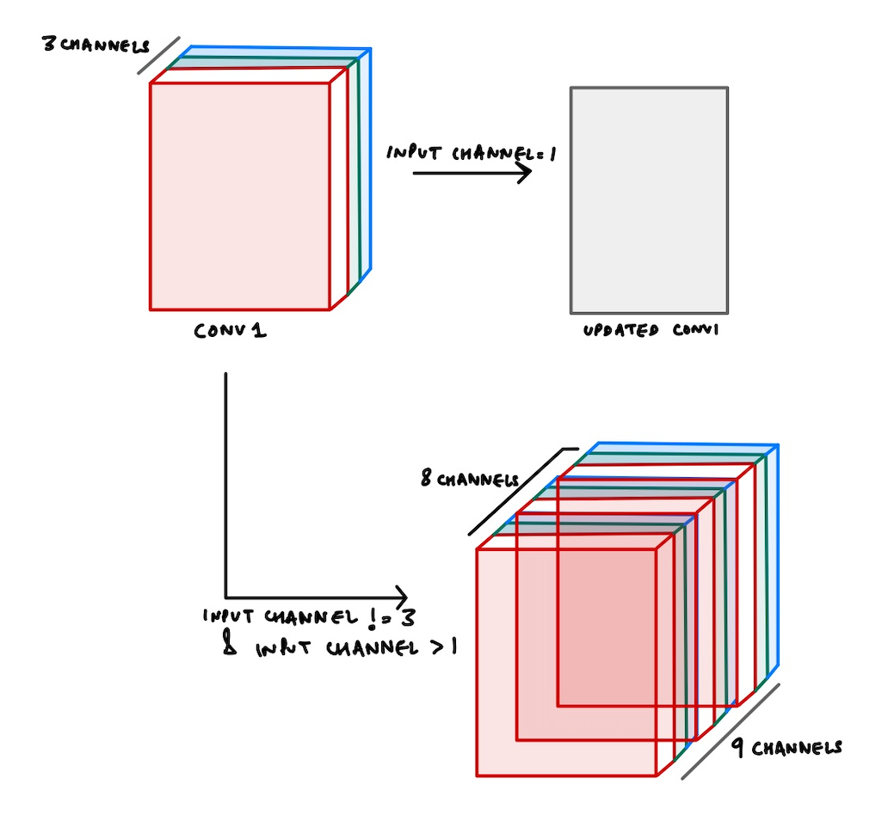

## TorchSeg

TorchSeg is an actively maintained and up-to-date fork of the [Segmentation Models PyTorch (smp) library](https://github.com/qubvel/segmentation_models.pytorch).

#### Updates

The goal of this fork is to 1) provide maintenance support for the original library and 2) add features relevant to modern semantic segmentation. Since the fork, this library has added some features which can be summarized below:

- Improved [PyTorch Image Models (timm)](https://github.com/huggingface/pytorch-image-models) for models with feature extraction functionality (852/1017=84% of timm models). This includes the typical CNN models such as `ResNet`, `EfficientNet`, etc., but now extends to include modern architectures like `ConvNext`, `Swin`, `PoolFormer`, `MaxViT` and more!
- Support for pretrained Vision Transformer (ViT) encoders. Currently timm ViTs do not support feature extraction out of the box. However we have added support for extracting intermediate transformer encoder layer feature maps to obtain this functionality. We support 100+ ViT based models including `ViT`, `DeiT`, `FlexiViT`!


Additionally we have performed the following for improved software standards:

- More thorough testing and CI
- Formatting using `black`, `isort`, `flake8`, `mypy`
- Reduction of dependence on unmaintained libraries (now depends only on `torch`, `timm`, and `einops`)
- Reduce lines of code to maintain (removed custom utils, metrics, encoders) in favor of newer libraries such as `torchmetrics` and `timm`


#### Features
The main features of this library are:

 - High level API (just two lines to create a neural network)
 - 9 segmentation architectures for binary and multi class segmentation (including U-Net, DeepLabV3)
 - Support for 852/1017 (~84%) of available encoders from [timm](https://github.com/rwightman/pytorch-image-models)
 - All encoders have pre-trained weights for faster and better convergence
 - Popular segmentation loss functions

#### Example Usage

Segmentation model is just a PyTorch nn.Module, which can be created as easy as:

```python
import torchseg

model = torchseg.Unet(
    encoder_name="resnet34",        # choose encoder, e.g. mobilenet_v2 or efficientnet-b7
    encoder_weights="imagenet",     # use `imagenet` pre-trained weights for encoder initialization
    in_channels=1,                  # model input channels (1 for gray-scale images, 3 for RGB, etc.)
    classes=3,                      # model output channels (number of classes in your dataset)
)
```

### Models

#### Architectures (Decoders)

   - Unet [[paper](https://arxiv.org/abs/1505.04597)]
   - Unet++ [[paper](https://arxiv.org/pdf/1807.10165.pdf)]
   - MAnet [[paper](https://ieeexplore.ieee.org/abstract/document/9201310)]
   - Linknet [[paper](https://arxiv.org/abs/1707.03718)]
   - FPN [[paper](http://presentations.cocodataset.org/COCO17-Stuff-FAIR.pdf)]
   - PSPNet [[paper](https://arxiv.org/abs/1612.01105)]
   - PAN [[paper](https://arxiv.org/abs/1805.10180)]
   - DeepLabV3 [[paper](https://arxiv.org/abs/1706.05587)]
   - DeepLabV3+ [[paper](https://arxiv.org/abs/1802.02611)]

#### Encoders

TorchSeg relies entirely on the [timm](https://github.com/huggingface/pytorch-image-models) library for pretrained encoder support. This means that TorchSeg supports any timm model which has `features_only` feature extraction functionality. Additionally we support any ViT models with a `get_intermediate_layers` method. This results in a total of 852/1017 (~84%) encoders from timm including `ResNet`, `Swin`, `ConvNext`, `ViT`, and more!

To list the following supported encoders:

```python
import torchseg

torchseg.list_encoders()
```

We have additionally pulled the the feature extractor metadata of each model with `features_only` support from timm at `output_stride=32`. This metadata provides information such as the number of intermediate layers, channels for each layer, layer name, and downsampling reduction.

```python
import torchseg

metadata = torchseg.encoders.TIMM_ENCODERS["convnext_base"]
print(metadata)

"""
{
   'channels': [128, 256, 512, 1024],
   'indices': (0, 1, 2, 3),
   'module': ['stages.0', 'stages.1', 'stages.2', 'stages.3'],
   'reduction': [4, 8, 16, 32],
}
"""

metadata = torchseg.encoders.TIMM_ENCODERS["resnet50"]
print(metadata)

"""
{
   'channels': [64, 256, 512, 1024, 2048],
   'indices': (0, 1, 2, 3, 4),
   'module': ['act1', 'layer1', 'layer2', 'layer3', 'layer4'],
   'reduction': [2, 4, 8, 16, 32]
}
"""
```

#### Models API

   - `model.encoder` - pretrained backbone to extract intermediate features
   - `model.decoder` - network for processing the intermediate features to the original image resolution (`Unet`, `DeepLabv3+`, `FPN`)
   - `model.segmentation_head` - final block producing the mask output (includes optional upsampling and activation)
   - `model.classification_head` - optional block which create classification head on top of encoder
   - `model.forward(x)` - sequentially pass `x` through model\`s encoder, decoder and segmentation head (and classification head if specified)

##### Input channels

Timm encoders supports the use of pretrained weights with arbitrary input channels by repeating weights for channels if > 3. For example, if `in_channels=6`, RGB ImageNet pretrained weights in the initial layer would be repeated `RGBRGB` to avoid random initialization. For `in_channels=7` this would result in `RGBRGBR`. Below is a diagram to visualize this method.

<p align="center">
    <br/>
</p>

##### Auxiliary Classifier

All models support an optional auxiliary classifier head through the use of `aux_params`. If `aux_params != None` then the
model will produce the a `label` output in addition to the `mask` output with shape `(N, C)`.
Classification head consists of GlobalPooling->Dropout(optional)->Linear->Activation(optional) layers, which can be
configured by `aux_params` as follows:

```python
aux_params=dict(
    pooling='avg',             # one of 'avg', 'max'
    dropout=0.5,               # dropout ratio, default is None
    activation=nn.Sigmoid(),   # activation function, default is Identity
    classes=4,                 # define number of output labels
)
model = torchseg.Unet('resnet18', classes=4, aux_params=aux_params)
mask, label = model(x)
```

##### Depth

Depth represents the number of downsampling operations in the encoder, so you can make
your model lighter by specifying less `depth`. Defaults to `depth=5`.

Note that some models like `ConvNext` and `Swin` only have 4 intermediate feature blocks. Therefore, to use these encoders set `encoder_depth=4`. This can be found in the metadata above.

```python
model = torchseg.Unet('resnet50', encoder_depth=4)
```
